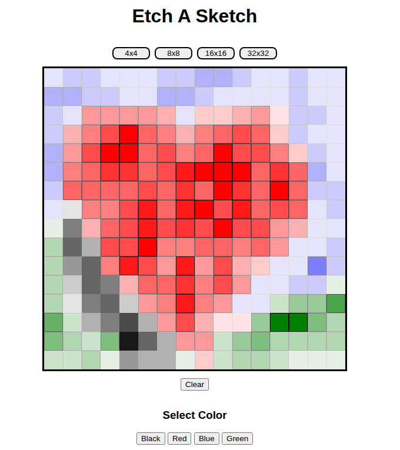

# Etch a Sketch
A Drawing Program where you can draw a grid, and draw across it

## Goals
- Practise javascript
- Practise manipulating the DOM
- Practise event listeners

## What I Learnt
How to utiize the DOM to draw smooth lines and manipulate local variables inside divs
generated by javascript.

## Screenshot
